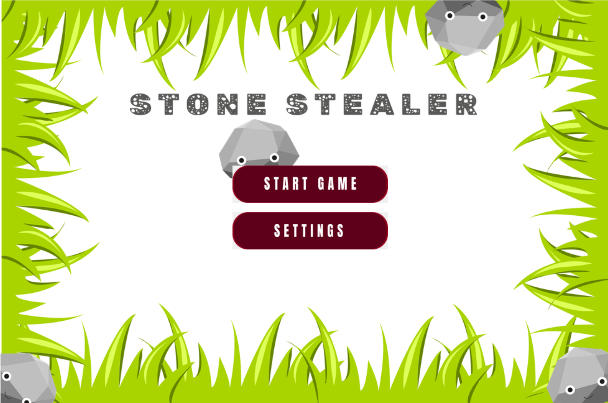
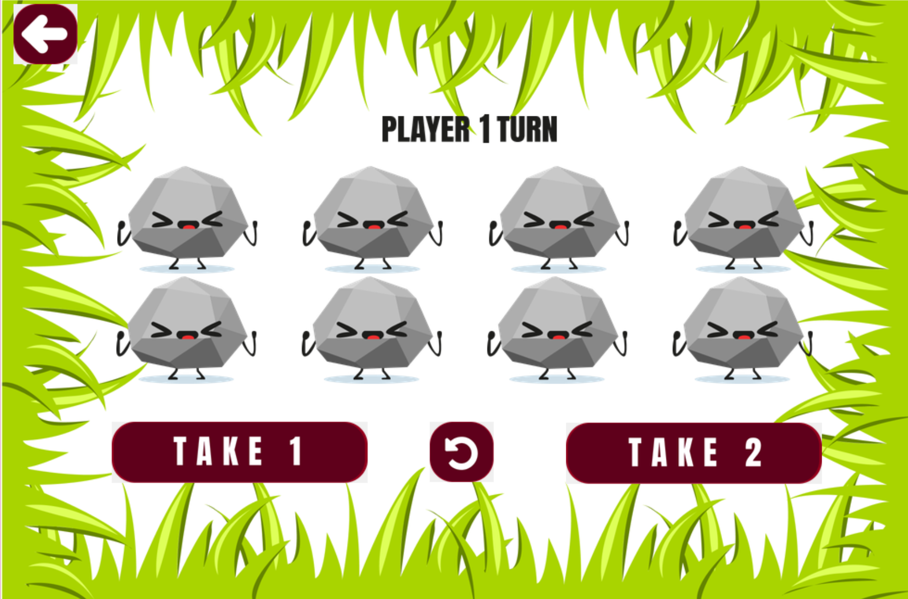

# Stone Stealer 💡

Stone Stealer is a simple game inspired by the classic Nim Game, implemented using Tkinter for the GUI and sprites drawn in Adobe Illustrator.

## Description 📘

Stone Stealer is a turn-based game where players take turns to remove stones from a pile. The player who takes the last stone wins the game. Each player can remove 1 or 2 stones from the pile





## Installation 💿

1. Clone this repository:

    ```
    git clone https://github.com/ke1rro/stone-stealer.git
    ```

2. Run the game:

    ```
    python main.py
    ```

## How to Play 🎮

1. Start the game by running the `main.py` file.
2. Players take turns removing 1 or 2 stones from the pile.
3. The player who removes the last stone wins the game.
